>[!IMPORTANT]
> Esse projeto foi concluído e apresentado por mim durante o curso de Técnico em Informática pelo Senac São Carlos, no encerramento do segundo módulo voltado para redes;
>
> O projeto é fictício, mas plausível para implantação num ambiente real — no qual é o objetivo do curso.
>
>
> Isto levou tempo e não foi fácil, pois não apenas pesquisei como elaborar uma documentação apropriada, mas também compreender e aplicar todas as tecnicalidades envolvidas no projeto lógico (rede) e no projeto físico (local, planta baixa, etc.). Mesmo sendo uma experiência difícil e ao mesmo tempo divertida, no final deu tudo certo e aprendi muita coisa e guardo isso com muito orgulho. 😁
>
> Para o projeto lógico, foi utlizado o app Cisco Packet Tracer. As imagens do projeto original juntamente com o .pkt se encontram na pasta [project-assets](./project-assets/). Para desenhos da planta baixa eu utilizei o [Microsoft Visio](https://www.microsoft.com/en-us/microsoft-365/visio).
>
> E sim - o nome do hotel é uma referência á musica "Hotel Califórnia", feita pelo Eagles na década de 70.

---

<div align="center">


# Implantação de Rede Estruturada — Hotel Califórnia

**SENAC São Carlos — Curso Técnico em Informática**

**Autor:** Eduardo Oliveira Machado
— **Turma:** 42 |  **Ano:** 2024

</div>

---

<div align="center">

## Resumo

</div>

Este projeto mostra a implantação de uma rede estruturada em uma área operacional de um hotel (3 andares) para o funcionamento de todos os equipamentos, entregando uma padronização em todas as etapas — principalmente em infraestrutura, o que é vital para o bom funcionamento e longevidade deste projeto. As tecnologias e padronizações utilizadas em todo o processo possibilitam uma futura escalabilidade do hotel facilitada e sem prejuízos para o usuário final.

**Palavras-chave:** Rede estruturada. Padronizações. Infraestrutura.

---

<div align="center">

## Sumário

</div>

- [1. Introdução](#1-introdução)
  - [1.1 Problema](#11-problema)
  - [1.2 Objetivos](#12-objetivos)
  - [1.3 Justificativa](#13-justificativa)
  - [1.4 Procedimentos Metodológicos](#14-procedimentos-metodológicos)
- [2. Fundamentação Teórica](#2-fundamentação-teórica)
  - [2.1 Cabeamento Estruturado](#21-cabeamento-estruturado)
  - [2.2 OSPFv2](#22-ospfv2)
  - [2.3 Roteador como Servidor DHCP](#23-roteador-como-servidor-dhcp)
  - [2.4 Roteamento entre VLANs e Subinterfaces](#24-roteamento-entre-vlans-e-subinterfaces)
  - [2.5 Access Point](#25-access-point)
  - [2.6 Servidor FTP](#26-servidor-ftp)
  - [2.7 Lista de Controle de Acesso Estendida (Extended ACL)](#27-lista-de-controle-de-acesso-estendida-extended-acl)
- [3. Projeto](#3-projeto)
  - [3.1 Infraestrutura do Projeto](#31-infraestrutura-do-projeto)
- [4. Conclusão](#4-conclusão)
- [Referências](#referências)

---

<div align="center">

## 1. Introdução

</div>

Atualmente, a internet deixou muitas de nossas tarefas ou trabalhos diários com uma maior comodidade e facilidade de resolução e acessos.

Porém, por trás de todas as facilidades que ela nos oferece, existe todo um processo e estruturação para que toda essa comunicação com a internet e todos os serviços que executamos nela seja feita com eficiência e qualidade.

Esses detalhes muitas vezes são pouco percebidos por não serem tão visíveis, como por exemplo, cabos de qualidade, instalações elétricas adequadas aterradas apropriadamente, entre outros exemplos. Tudo isso necessita de um bom planejamento e instalação de uma infraestrutura de rede.

Neste projeto será abordado todos os detalhes de seu planejamento até sua instalação final, por meio de roteadores, switches e por fim um servidor FTP local numa rede distinta. Essa rede privada será organizada e se comunicará por meio de VLANs utilizando subinterfaces (router-on-a-stick), protocolo de roteamento OSPF e a implantação de Extended Access Lists para permitir e negar acessos devidos ou indevidos nesta rede.

<div align="center">

### 1.1 Problema

</div>

Um hotel comercial necessita de uma infraestrutura de rede e elétrica para funcionar adequadamente. Se o projeto e/ou a instalação forem malfeitos, uma série de problemas poderão ocorrer:

- Perda de vendas e clientes por eventual lentidão no sistema;
- Filas nos pontos de atendimento (Recepção ou loja de conveniência, por exemplo);
- Problemas em consultas a dados importantes para o funcionamento do estabelecimento como um todo;
- Queima ou danificação de equipamentos.

<div align="center">

### 1.2 Objetivos

#### 1.2.1 Geral

</div>

Projetar e implementar uma rede corporativa para empresas de pequeno e médio porte.

<div align="center">

#### 1.2.2 Objetivos Específicos

</div>

- Projeto da arquitetura da rede;
- Projeto da rede elétrica estabilizada;
- Solicitação de links (preferencialmente FTTO) na operadora;
- Instalação do cabeamento estruturado, acompanhando a instalação do meio físico necessário;
- Configuração de gerência de rede em roteadores e switches.

<div align="center">

### 1.3 Justificativa

</div>

Ganho de velocidade nas operações, maior número de transações por minuto, agilidade em consultas ao estoque ou catálogos, economia gerada pela maior vida útil dos equipamentos. A manutenção é facilitada, pois existe uma padronização nas instalações.

<div align="center">

### 1.4 Procedimentos Metodológicos

</div>

Será utilizada a literatura técnica necessária como base de pesquisa, documentação técnica dos equipamentos fornecidos pelos fabricantes e normas técnicas para padronização. Estas informações serão coletadas por meio de sites, livros e manuais de instalação/configuração.


<p align="center">
  <a href="#implantação-de-rede-estruturada--hotel-califórnia"> <small> ⬆️ Voltar ao Sumário </a> </small> </p>

---

<div align="center">

## 2. Fundamentação Teórica

### 2.1 Cabeamento Estruturado

#### 2.1.1 Infraestrutura mínima nas instalações do usuário

</div>

Os itens abaixo são requisitos mínimos que o usuário deverá providenciar e disponibilizar para a instalação do link em fibra óptica, sendo de responsabilidade única do cliente:

- Ponto de energia elétrica para alimentação do modem;
- Tubulação livre com caixas de passagem para lançamento de fibra óptica (ou backbone) de no mínimo 50mm de diâmetro;
- Rack de 22U para o primeiro andar (onde será a sala de equipamentos) e racks de parede 6U para o térreo e segundo andar;
- Salas identificadas e padronizadas decididas em um layout.

<div align="center">

#### 2.1.2 Rack 22U — Sala de Equipamentos (1º Andar)

</div>

É recomendado que o usuário disponibilize um espaço de pelo menos 2U em um rack para a instalação do modem da operadora. Os equipamentos alocados neste rack são:

| Equipamento | Espaço ocupado |
|---|---|
| Patch Panel 24 portas | 2U |
| Switch Cisco 2960 (24 portas) | 2U |
| Servidor FTP | 1U |
| Modem | 1U |
| Roteadores Cisco 2911 (3 unidades) | 2U cada |
| Alimentação | 1U |


<div align="center">

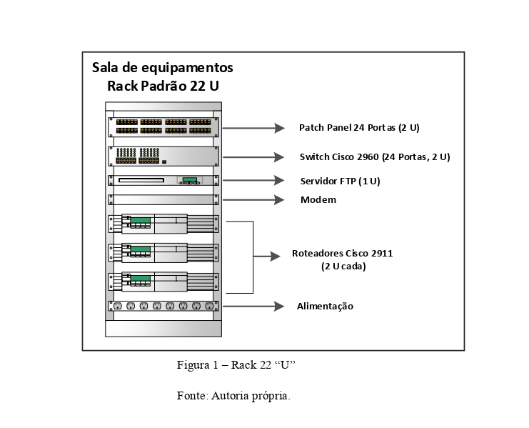
> *Figura 1 — Rack 22U, Sala de Equipamentos (1º Andar). Fonte: Autoria própria.*

</div>

<div align="center">

#### 2.1.3 Rack 6U de Parede — Térreo e 2º Andar

</div>

Para os outros andares foram disponibilizados dois racks de 6U fixados na parede, contendo:

| Equipamento | Espaço ocupado |
|---|---|
| Patch Panel 24 portas | 1U |
| Switch Cisco 2960 (24 portas) | 2U |
| Alimentação | 1U |


<div align="center">


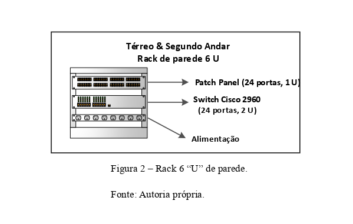
> *Figura 2 — Rack 6U de parede, Térreo e 2º Andar. Fonte: Autoria própria.*

</div>

<div align="center">

#### 2.1.4 Entrada do Cabo Óptico

</div>

A entrada do cabo óptico nas instalações do prédio pode ser realizada de duas maneiras:

**1. Duto de descida subterrâneo:** O cabo ancorado no poste desce por duto vertical e segue por duto subterrâneo através de caixas de passagem até o ponto de entrega.

**2. Descida aérea com passagem pela parede:** O cabo óptico ancorado no poste segue até a parede da construção. É ancorado através da instalação de um olhal reto ou conjunto isolador vertical (armação com roldana) pela operadora, fixado por parafuso M12 instalado pelo usuário.


<div align="center">

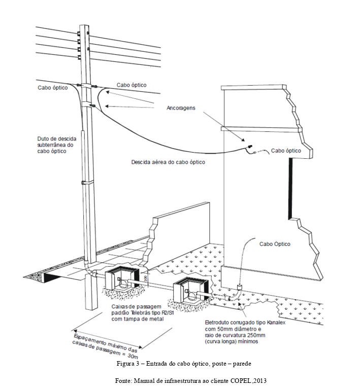

> *Figura 3 — Entrada do cabo óptico, poste–parede. Fonte: Manual de Infraestrutura ao Cliente COPEL, 2013.*

</div>

<div align="center">

#### 2.1.5 Topologia de Rede

</div>

A topologia de rede projetada para o hotel é do tipo **estrela**, onde todos os dispositivos da rede local (exceto switches do piso térreo e segundo andar) se conectam a um ponto central.


<div align="center">

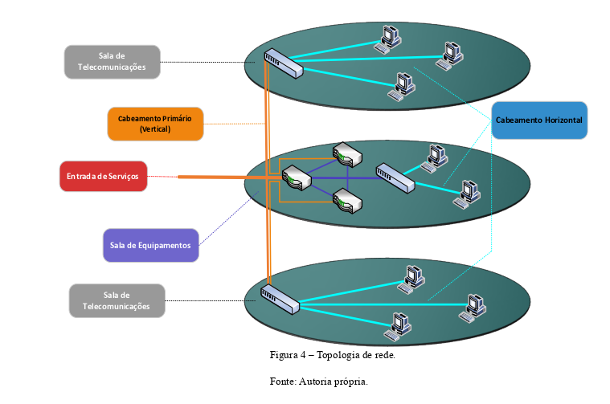

> *Figura 4 — Topologia de rede. Fonte: Autoria própria.*

</div>


<p align="center">
  <a href="#implantação-de-rede-estruturada--hotel-califórnia"> <small> ⬆️ Voltar ao Sumário </a> </small> </p>

---

<div align="center">

### 2.2 OSPFv2

</div>

O protocolo OSPF (*Open Shortest Path First*) é um protocolo de roteamento utilizado em redes IP para determinar os melhores caminhos de roteamento entre roteadores. Ele pertence à categoria de protocolos de roteamento interno, sendo usado dentro de uma única organização ou rede autônoma.

O OSPF é um protocolo robusto e escalável que facilita a troca de informações de roteamento dentro de uma rede, garantindo conectividade eficaz e redundância, além de permitir uma administração flexível por meio de diferentes áreas (Cisco, 2016).

Diferentemente de rotas estáticas, este protocolo identifica rotas alternativas, porém sempre priorizando rotas de menor custo ou mais eficientes, o que garante melhor qualidade da rede.

Neste projeto, o OSPF foi implementado em redes vizinhas (adjacências) e por área única.

**Endereço IP base para comunicação entre roteadores:** `201.150.0.0/30`


<div align="center">

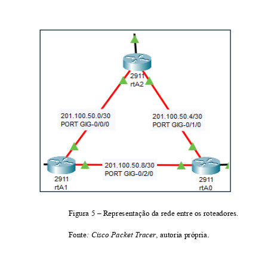

> *Figura 5 — Representação da interconexão entre os roteadores. Fonte: Cisco Packet Tracer, autoria própria.*

</div>

<p align="center"> <strong> Tabela 1 — Adjacências no roteamento OSPFv2 </p> </strong>

| Roteador | Redes Adjacentes |
|---|---|
| rtA0 | 201.100.50.4/30 e 201.100.50.8/30 |
| rtA1 | 201.100.50.0/30 e 201.100.50.8/30 |
| rtA2 | 201.100.50.0/30 e 201.100.50.4/30 |


<p align="center">
  <a href="#implantação-de-rede-estruturada--hotel-califórnia"> <small> ⬆️ Voltar ao Sumário </a> </small> </p>

---

<div align="center">

### 2.3 Roteador como Servidor DHCP

</div>

Os roteadores funcionam como servidores DHCP, "emprestando" endereços IP para dispositivos conectados dentro da rede privada. Cada roteador é responsável pela distribuição de IPs nas VLANs sob sua gestão.


<div align="center">

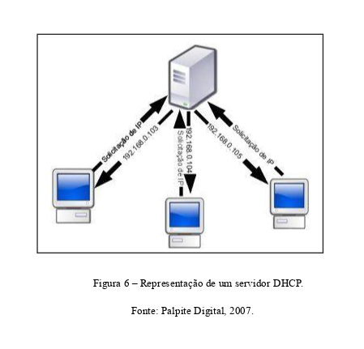
> *Figura 6 — Representação da funcionalidade do servidor DHCP. Fonte: Palpite Digital, 2007.*

</div>

<p align="center">
  <a href="#implantação-de-rede-estruturada--hotel-califórnia"> <small> ⬆️ Voltar ao Sumário </a> </small> </p>

---

<div align="center">

### 2.4 Roteamento entre VLANs e Subinterfaces

</div>

Este método envolve o uso de um roteador capaz de rotear pacotes entre VLANs. Cada VLAN é configurada com uma sub-rede IP separada, e o roteador possui subinterfaces para cada uma delas, encaminhando pacotes com base em informações de roteamento e regras configuradas — técnica conhecida como **Router-on-a-Stick**.


<div align="center">

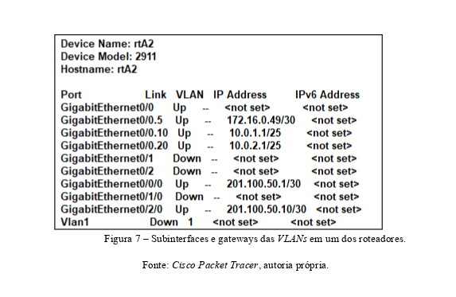
> *Figura 7 — Configuração de subinterfaces VLAN e gateways. Fonte: Cisco Packet Tracer, autoria própria.*

</div>

<p align="center"> <strong> Tabela 2 — Subinterfaces para roteamento entre VLANs </p> </strong>

| VLAN | Departamento | Roteador | Rede | Subinterface |
|------|-------------|----------|------|--------------|
| VLAN 5 | Servidor FTP | A1 | 172.16.0.48/30 | Gig0/0.5 |
| VLAN 10 | TI | A1 | 10.0.1.0/25 | Gig0/0.10 |
| VLAN 20 | Diretoria | A1 | 10.0.2.0/25 | Gig0/0.20 |
| VLAN 30 | RH | A2 | 10.0.3.0/25 | Gig0/0.30 |
| VLAN 40 | Marketing | A2 | 10.0.4.0/25 | Gig0/0.40 |
| VLAN 50 | Financeiro | A2 | 10.0.5.0/25 | Gig0/0.50 |
| VLAN 60 | Recepção | A0 | 10.0.6.0/25 | Gig0/0.60 |
| VLAN 70 | Almoxarifado | A0 | 10.0.7.0/25 | Gig0/0.70 |
| VLAN 80 | Conveniência | A0 | 10.0.8.0/25 | Gig0/0.80 |

<div align="center">

#### 2.4.1 Switch em Modo de Acesso e Modo Tronco

</div>

Um switch pode gerenciar suas portas em diferentes modos. A configuração usada no projeto envolve dois deles:

<p align="center"> <strong> Tabela 3 — Diferenças entre modo de acesso e modo tronco </p> </strong>

| Porta em Modo de Acesso | Porta em Modo Tronco |
|---|---|
| Funciona com uma única VLAN, sem etiquetas, na camada 2 | Permite tráfego de várias VLANs por meio de etiquetas |
| Pertence somente a uma VLAN | É membro de todas as VLANs configuradas |
| Usado para conectar dispositivos finais (endpoint) | Usado para conectar switches entre si |
| Comando: `switchport mode access` | Comando: `switchport mode trunk` |
| Não transporta etiquetação de VLANs | Usa encapsulação 802.1Q |

<p align="center"> <strong> Padrão de configuração adotado: </p> </strong>

- Portas em modo de acesso → configuradas em ordem <strong>crescente</strong> (fa0/1 em diante) </br>
- Portas em modo tronco → configuradas em ordem <strong>decrescente</strong> (somente fa0/24) </br>


<div align="center">

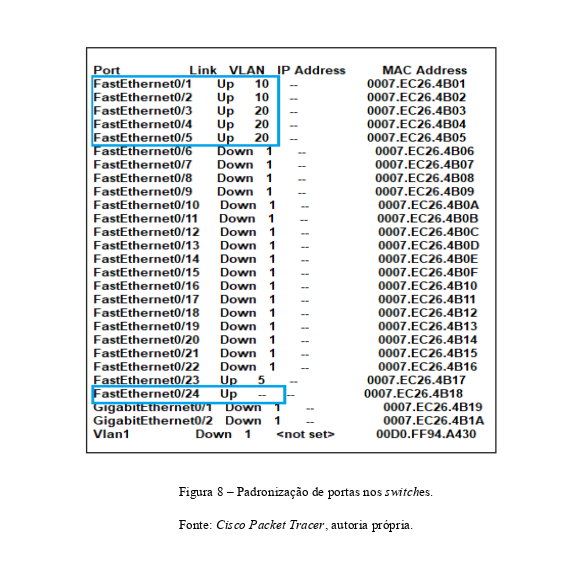
> *Figura 8 — Padronização de portas nos switches. Fonte: Cisco Packet Tracer, autoria própria.*


<p align="center">
  <a href="#implantação-de-rede-estruturada--hotel-califórnia"> <small> ⬆️ Voltar ao Sumário </a> </small> </p>

</div>

---

<div align="center">

### 2.5 Access Point

</div>

Para maior comodidade dos usuários locais, clientes e visitantes, o hotel conta com pontos de acesso wireless, um em cada piso. Como a área de cada piso é de 450m², poderão ser utilizados repetidores ou APs adicionais para cobrir o sinal sem deterioração.

<p align="center">
  <a href="#implantação-de-rede-estruturada--hotel-califórnia"> <small> ⬆️ Voltar ao Sumário </a> </small> </p>

---

<div align="center">

### 2.6 Servidor FTP

</div>

O hotel utiliza um servidor FTP em rack de dimensão 1U, instalado na sala de equipamentos (1º andar).

<p align="center"> <strong> Requisitos mínimos: </p> </strong>

| Componente | Especificação |
|---|---|
| Processador | 64 bits |
| Memória RAM | 2GB (aumentar conforme número de usuários) |
| Armazenamento | 100GB |
| Interface de rede | Ethernet |
| Sistema Operacional | Linux ou Windows |
| Software | vsftpd (Linux) ou FileZilla Server (Windows) |

Essas configurações são capazes de lidar com as necessidades de armazenamento e transferência de arquivos sem problemas de desempenho, considerando que esta unidade terá acesso restrito para usuários específicos.


<div align="center">

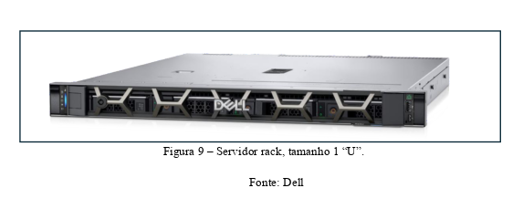
> *Figura 9 — Servidor FTP rack 1U. Fonte: Dell.*

<p align="center">
  <a href="#implantação-de-rede-estruturada--hotel-califórnia"> <small> ⬆️ Voltar ao Sumário </a> </small> </p>

</div>

---

<div align="center">

### 2.7 Lista de Controle de Acesso Estendida (Extended ACL)

</div>

Por padrão, roteadores não diferenciam pacotes genuínos de falsos. Extended ACLs permitem criar critérios e ações para permitir ou negar tráfegos específicos. O roteador verifica a lista de acesso de cima para baixo até encontrar uma correspondência.

> [!IMPORTANT] 
>
> Existe uma regra implícita de `deny any` ao final de toda ACL. Portanto, apenas os tráfegos explicitamente permitidos passam.

<p align="center"> <strong> Regras do projeto: </strong> </p>

- O servidor FTP (`VLAN 5 — 172.16.0.48/30`) deve ter acesso restrito;
- Acessos **permitidos:** TI (VLAN 10), Diretoria (VLAN 20) e Marketing (VLAN 40);
- Todas as demais redes: acesso **negado**.

<p align="center"> <strong> Configuração aplicada no roteador A2: </strong> </p>


<div align="center">

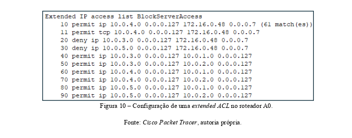
> *Figura 10 — Configuração de Extended ACL no roteador A2. Fonte: Cisco Packet Tracer, autoria própria.*

</div>

<p align="center"> <strong> Configuração aplicada no roteador A0: </strong> </p>


<div align="center">

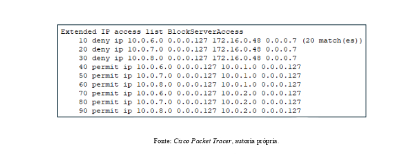
> *Figura 11 — Configuração de Extended ACL no roteador A0. Fonte: Cisco Packet Tracer, autoria própria.*


</div>


> [!IMPORTANT]
> Este é o jeito mais "complicado" de se aplicar as ACLs, já que estou usando regras mais granulares em dois roteadores (A2 e A0) definindo em várias linhas o que é permitido ou não trafegar.
>
> Uma outra maneira direta e simples de bloquear o acesso das VLANs indevidas ao servidor e manter as mesmas se comunicando com o restante da rede é aplicar uma regra no roteador A1 — que gerencia o servidor e as VLANs 10 e 20:
>
> ```
>10 permit 10.0.1.0 0.0.0.127 172.16.0.48 0.0.0.7   
>20 permit 10.0.2.0 0.0.0.127 172.16.0.48 0.0.0.7   ##  Abre as permissões devidas (VLAN 10, 20 e 40).
>30 permit 10.0.4.0 0.0.0.127 172.16.0.48 0.0.0.7   
>40 deny ip any 172.16.0.48 0.0.0.7                 ##  Nega qualquer outro acesso.
>50 permit any any                                  ##  Abre tráfego entre o restante da rede.
> ```


<p align="center">
  <a href="#implantação-de-rede-estruturada--hotel-califórnia"> <small> ⬆️ Voltar ao Sumário </a> </small> </p>


---

<h2 align="center"> Desenho Lógico </h2>

> [!NOTE]
> Este é o desenho lógico da rede no Packet Tracer, o mesmo encontrado no [arquivo .pkt](./project-assets/hotel-cali-8-1-1.pkt), porém não incluso na documentação original.


  <div align="center">

  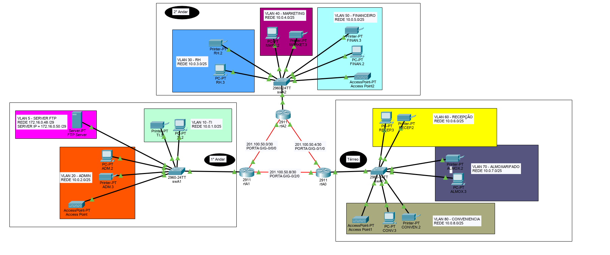


  <p align="center">
  <a href="#implantação-de-rede-estruturada--hotel-califórnia"> <small> ⬆️ Voltar ao Sumário </a> </small> </p>

  </div>

---
  


<div align="center">

## 3. Projeto

### 3.1 Infraestrutura do Projeto

#### 3.1.1 Planta Baixa

</div>

O hotel possui 3 andares (piso térreo e os dois andares superiores) onde funciona a parte operacional. A parte interior do prédio mede 15×30m (450m²), com área útil variando entre 330m² e 370m².

Todo o cabeamento da rede elétrica e lógica do projeto é aterrado em cada andar, ligado ao subsolo do hotel por meio de um eletrodo.

<p align="center"> <strong> Piso Térreo:</strong> Recepção, Almoxarifado, Loja de Conveniência e Sala de Equipamentos. </p>


<div align="center">

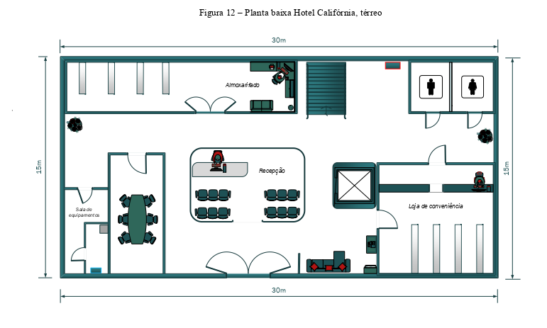
> *Figura 12 — Planta baixa: Piso Térreo. Fonte: Autoria própria.*

</div>

<p align="center"> <Strong> Primeiro Andar:</strong> TI, Diretoria, Cozinha e Área de Lazer. </p>


<div align="center">

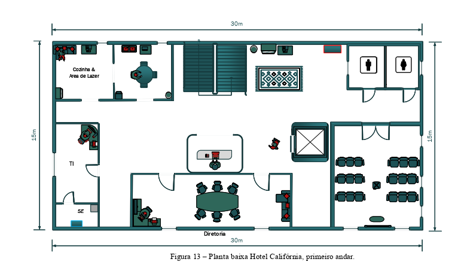
> *Figura 13 — Planta baixa: Primeiro Andar. Fonte: Autoria própria.*

</div>

<p align="center"> <strong> Segundo Andar:</strong> RH, Financeiro, Vendas/Marketing. </p>


<div align="center">

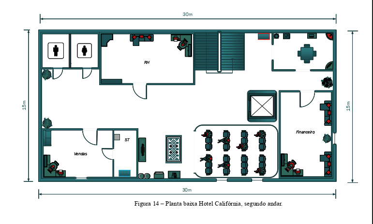
> *Figura 14 — Planta baixa: Segundo Andar. Fonte: Autoria própria.*

<p align="center">
  <a href="#implantação-de-rede-estruturada--hotel-califórnia"> <small> ⬆️ Voltar ao Sumário </a> </small> </p>

</div>

---

<div align="center">

#### 3.1.2 Estruturas de Distribuição do Cabeamento

</div>

Os cabeamentos elétricos e de rede utilizam diferentes estruturas para sair dos quadros de distribuição até o dispositivo final.

<p align="center"> <strong> Eletrocalhas perfuradas: </p> </strong>

| Uso | Dimensões |
|---|---|
| Cabeamento lógico (rede) | 75×75mm |
| Cabeamento elétrico | 150×50mm |


<div align="center">

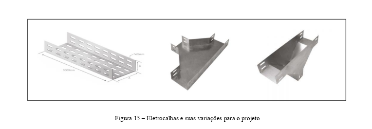
> *Figura 15 — Modelos de eletrocalhas utilizadas na estrutura. Fonte: Autoria própria.*

</div>

<p align="center"> <strong> Tabela 4 — Dimensões e ocupação para eletrocalhas </p> <strong>

| Categoria | Tipo | Diâmetro | Eletrocalha | Ocupação (50%) |
|---|---|---|---|---|
| Cat6 | U/UTP | 6,0mm | 75×75mm | 99 cabos |

<p align="center"> <strong> Tabela 5 — Dimensões e ocupação para eletrodutos </p> <strong>

| Diâmetro do Eletroduto | Diâmetro do Cabo | Quantidade de Cabos |
|---|---|---|
| 2" (53mm) | 6,0mm | Até 20 cabos |


<div align="center">

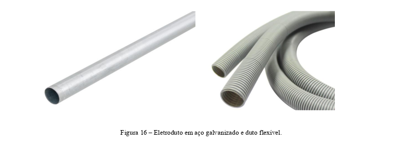
> *Figura 16 — Modelo de eletroduto utilizado na estrutura. Fonte: Autoria própria.*

<p align="center">
  <a href="#implantação-de-rede-estruturada--hotel-califórnia"> <small> ⬆️ Voltar ao Sumário </a> </small> </p>

</div>

---

<div align="center">

#### 3.1.3 Modo de Conexão

</div>

A conexão entre o usuário final e os equipamentos nos racks é feita pelo modo de **interconexão**, seguindo o caminho:

```
Equipamento ativo (switch)
        ↓ patch cord
   Patch Panel
        ↓ cabo horizontal (Cat6)
   Tomada RJ45 Cat6
        ↓ patch cord
   Equipamento terminal (PC, telefone, etc.)
```


<div align="center">

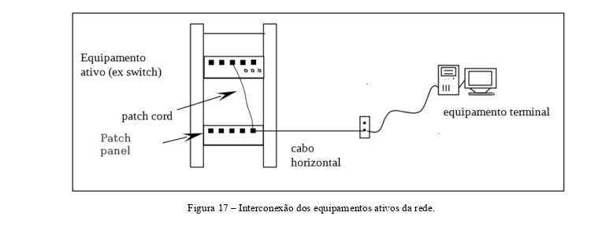
> *Figura 17 — Interconexão dos equipamentos ativos da rede. Fonte: Autoria própria.*

</div>

<p align="center"> As conexões dos dispositivos finais utilizam tomadas modulares <strong> RJ45 categoria 6 </strong>.</p>


<div align="center">

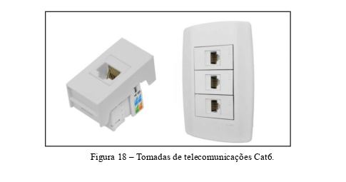
> *Figura 18 — Tomada de telecomunicações padrão Cat6. Fonte: Autoria própria.*

<p align="center">
  <a href="#implantação-de-rede-estruturada--hotel-califórnia"> <small> ⬆️ Voltar ao Sumário </a> </small> </p>

</div>

---

<div align="center">

#### 3.1.4 Distribuição do Cabeamento

</div>


| Legenda | Descrição |
|---|---|
| 01 🔴| Quadro de distribuição — Demais equipamentos |
| 02 🔵| Quadro de distribuição — Equipamentos de rede |
| 03 🔴| Eletrocalha elétrica |
| 04 🔵| Eletrocalha lógica |

<p align="center"> <strong> Piso Térreo: </p> <strong>

<div align="center">

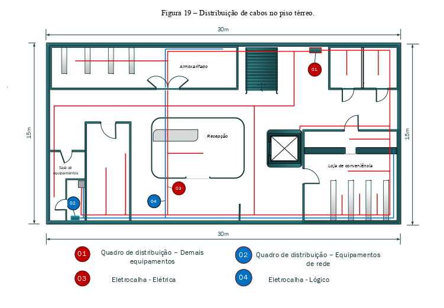
> *Figura 19 — Distribuição do cabeamento elétrico e lógico no piso térreo. Fonte: Autoria própria.*

</div>

<p align="center"> <strong> Primeiro Andar </p> <strong>


<div align="center">

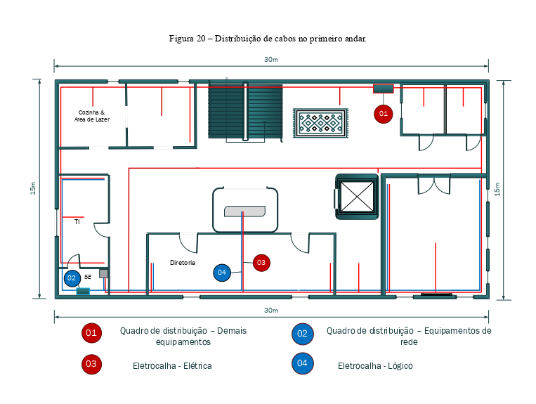
> *Figura 20 — Distribuição do cabeamento elétrico e lógico no primeiro andar. Fonte: Autoria própria.*

</div>

<p align="center"> <strong> Segundo Andar: </p> <strong>


<div align="center">

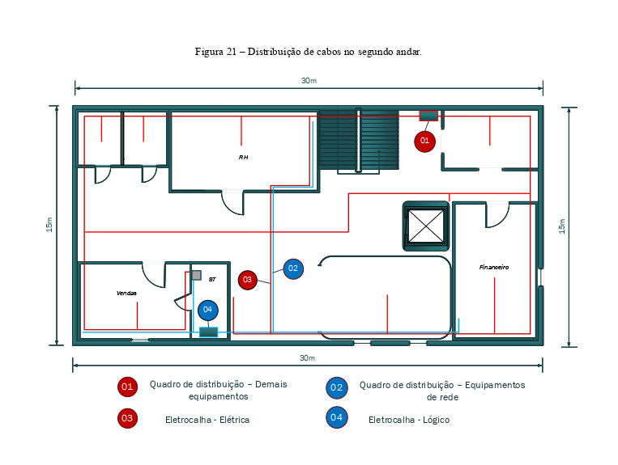
> *Figura 21 — Distribuição do cabeamento elétrico e lógico no segundo andar. Fonte: Autoria própria.*

<p align="center">
  <a href="#implantação-de-rede-estruturada--hotel-califórnia"> <small> ⬆️ Voltar ao Sumário </a> </small> </p>

</div>

---

<div align="center">

## 4. Conclusão

</div>

Como mostrado neste trabalho, para que empresas hoteleiras como esta possam ofertar as facilidades que clientes e funcionários desejam, faz-se necessário todo um investimento em infraestrutura de rede. Mostrou-se que com investimento em padronização de rede lógica e elétrica, equipamentos e infraestrutura, pode-se reduzir drasticamente a incidência de falhas na rede.

Foram abordadas três estruturas (térreo, primeiro andar e segundo andar) para uma empresa de pequeno/médio porte, com cada estrutura possuindo sua infraestrutura de rede e elétrica, adequando a melhor solução para cada caso.

Este projeto demonstrou como empresas pequenas e médias podem utilizar uma infraestrutura adequada às suas necessidades, garantindo a qualidade do serviço prestado.

A execução deste projeto melhorou o conhecimento em infraestrutura de equipamentos de telecomunicações, possibilitando o contato com diferentes soluções aplicadas no mundo real para os problemas e desafios que o tema propõe.

<p align="center">
  <a href="#implantação-de-rede-estruturada--hotel-califórnia"> <small> ⬆️ Voltar ao Sumário </a> </small> </p>

---

<div align="center">

## Referências

</div>

COPEL. **Manual de infraestrutura ao cliente**. Disponível em: <http://www.copel.com/hpcopel/telecom/sitearquivos2.nsf/arquivos/MITManualInfraestruturaCliente.pdf>. Acesso em: 13 maio 2024.

JVASCONCELLOS. **Norma NBR 14565 – Cabeamento de telecomunicações para edifícios comerciais**. Disponível em: <http://www.jvasconcellos.com.br/unijorge/wp-content/uploads/2011/07/NBR%2014565-2007.pdf>. Acesso em: abr. 2024.

TANENBAUM, Andrew S.; WETHERALL, David J. **Redes de Computadores**. São Paulo: Pearson Education, 2011.

TELECO. **Cabeamento estruturado**. Disponível em: <http://www.teleco.com.br/tutoriais/pdf2011/tutorialcabeamento.pdf>. Acesso em: abr. 2024.

SENAI. **Cabeamento estruturado**. Disponível em: <https://professorleonardomello.wordpress.com/wp-content/uploads/2013/03/cabeamento-estruturado.pdf>. Acesso em: 20 abr. 2024.

ELECON. **Materiais para estruturação elétrica predial e industrial**. Disponível em: <https://elecon.com.br/>. Acesso em: maio 2024.

FURUKAWA. **Boas práticas de instalação em cabeamento estruturado**. Disponível em: <https://docplayer.com.br/1440003-Boas-praticas-de-instalacao.html>. Acesso em: maio 2024.

---

<p align="center">
  Eduardo Oliveira Machado · SENAC São Carlos · Turma 42 · 2024
</p>

<p align="center">
  <a href="#implantação-de-rede-estruturada--hotel-califórnia"> <small> ⬆️ Voltar ao Sumário </a> </small> </p>